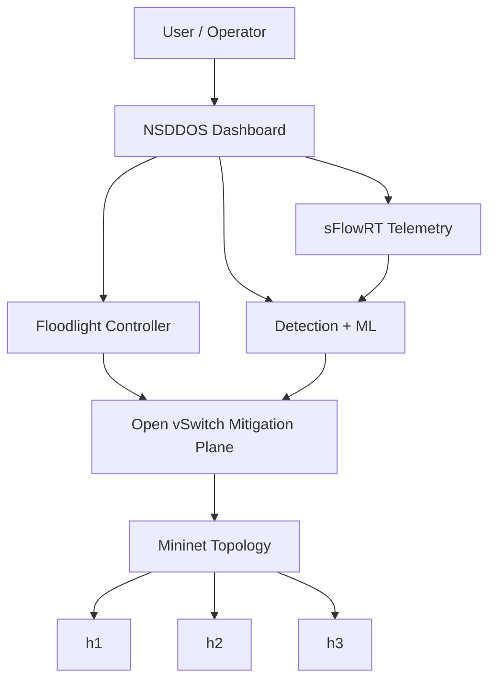
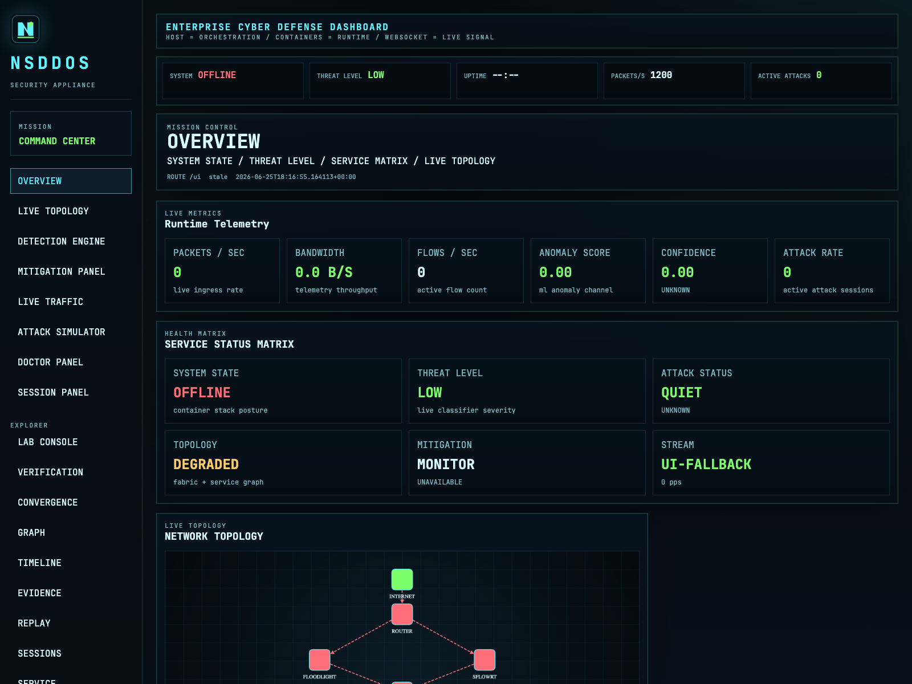
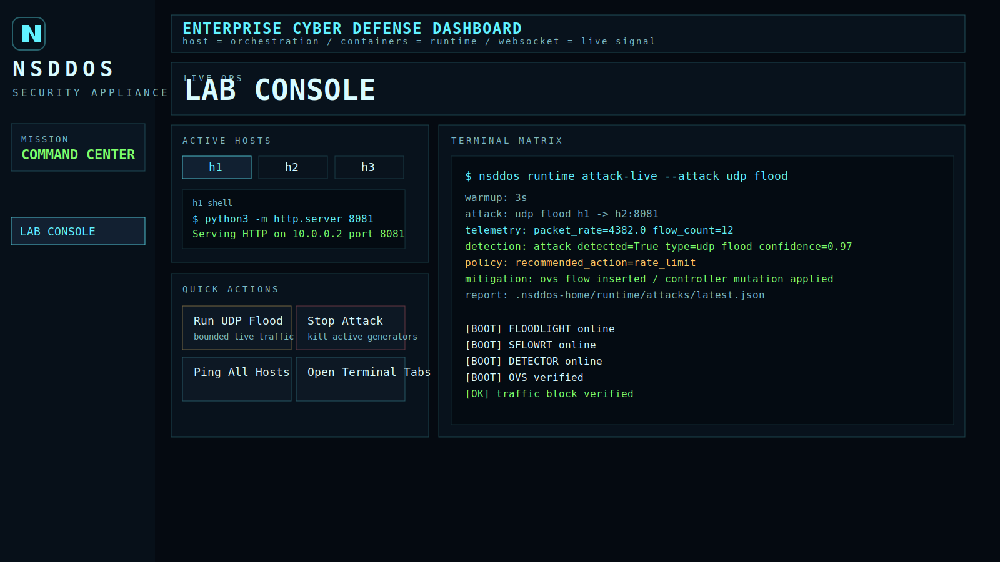
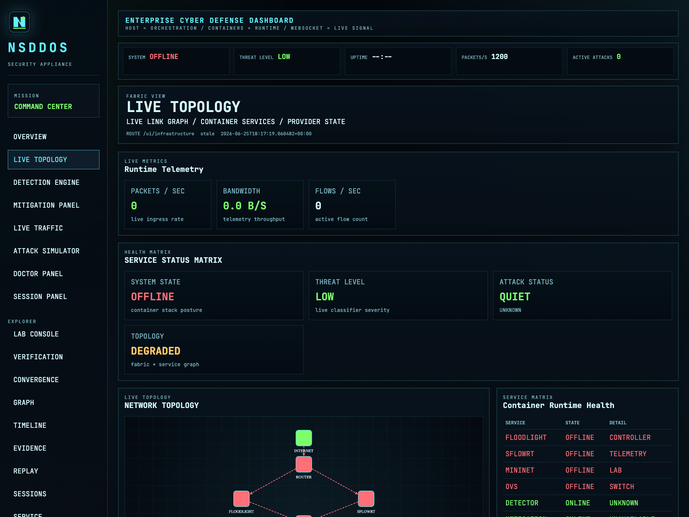

# NSDDOS

[](https://pypi.org/project/nsddos/)
[](https://pypi.org/project/nsddos/)
[](LICENSE)

Production-grade AI-powered DDoS detection and mitigation platform for software-defined networks and IoT environments.

NSDDOS packages telemetry collection, live attack simulation, SDN-aware mitigation, runtime verification, and SOC-style observability into one operator-facing workflow. It is built for local labs, demos, research validation, and repeatable release engineering around Floodlight, sFlowRT, Mininet, and Open vSwitch.

## Features

- Real-time DDoS attack detection
- Floodlight SDN controller integration
- sFlowRT telemetry engine
- Mininet virtual topology orchestration
- Open vSwitch programmable mitigation
- Live SOC-style operator dashboard
- ML-based anomaly detection engine
- Automated attack simulation
- Runtime health, doctor, and verification commands
- Public demo sharing through Cloudflare Tunnel

## Installation

Install from PyPI:

```bash
pip install nsddos
```

Install from source for development:

```bash
git clone https://github.com/ns7523/nsddos.git
cd nsddos
python -m venv .venv
source .venv/bin/activate
pip install -e .[dev]
```

Requirements:

- Python 3.11+
- Docker Engine
- Docker Compose v1 (`docker-compose`) or v2 (`docker compose`)
- Local runtime assets bundled in repo or downloaded through `nsddos bootstrap download`

Full setup notes: [docs/installation.md](docs/installation.md)

## Quick Start

```bash
nsddos setup
nsddos start
nsddos health --verbose
```

Run live end-to-end showcase:

```bash
nsddos demo
```

Expose dashboard publicly for demos:

```bash
nsddos ui expose
```

## Architecture



More detail: [docs/architecture.md](docs/architecture.md)

## Commands

Core workflow:

```bash
nsddos health
nsddos doctor
nsddos start
nsddos demo
nsddos ui start
nsddos ui expose
nsddos lab start
nsddos runtime attack-live
```

CLI reference: [docs/cli-reference.md](docs/cli-reference.md)

## Screenshots

### Overview



### Lab Console



### Topology



## Documentation

- [Installation Guide](docs/installation.md)
- [Architecture](docs/architecture.md)
- [CLI Reference](docs/cli-reference.md)
- [Troubleshooting](docs/troubleshooting.md)
- [Developer Guide](docs/developer-guide.md)
- [Runtime Assets](docs/runtime-assets.md)

## License

MIT. See [LICENSE](LICENSE).
